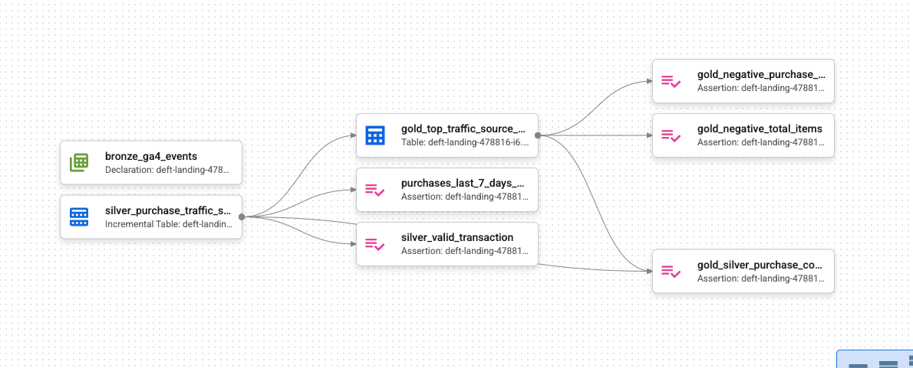

<h1>GA4 Dataform Pipeline (GCP)</h1>

A clean and scalable **Bronze → Silver → Gold** analytics pipeline built using **Dataform on Google Cloud** on top of the GA4 public e-commerce dataset.

---

<h2>Architecture Overview</h2>

---

<h3>1️⃣ Bronze Layer</h3>

- Raw GA4 event declaration  
- No transformations  
- Serves as the source for all downstream tables  

---

<h3>2️⃣ Silver Layer — <code>silver_purchase_traffic_source_medium</code></h3>

Cleans and prepares purchase events:

- Filters GA4 to only **purchase** events  
- Removes **(data deleted)** traffic sources  
- Parses **event_date** into `event_date_parsed`  
- Extracts:
  - `transaction_id`
  - `ga_session_id`
- Incremental **SCD-1 MERGE** using unique keys:
  - `event_timestamp`  
  - `user_pseudo_id`  
  - `transaction_id`
- Adds debug columns:
  - `items`
  - `traffic_source`

**Purpose:**  
- Clean, deduplicated, enriched fact table for analytics  

---

<h3>3️⃣ Gold Layer — <code>gold_top_traffic_source_medium</code></h3>

Aggregates monthly KPIs per traffic source medium:

- 💰 **Purchased value (USD)**  
- 📦 **Total items purchased**  
- 📊 **Avg items per purchase**  
- 🧮 **Purchase count**

**Purpose:**  
- Marketing & channel performance reporting  

---

<h2>🔍 Data Quality Tests (Assertions)</h2>

<h3>Silver Assertions</h3>

- `transaction_id` OR `event_value_in_usd` must exist  
- Purchase count must not be zero in the last 7 days  

---

<h3>Gold Assertions</h3>

- No negative items or usd values   
- Purchase count in **gold** must match count in **silver**  

---

<h2>Pipeline Execution</h2>

- Dataform compiles SQL actions and executes them in BigQuery  
- Silver runs as **incremental MERGE (SCD-1)**  
- Gold runs as a **full table refresh**  
- Assertions automatically validate schema & data quality  
- Lineage helps track dependencies across layers  

